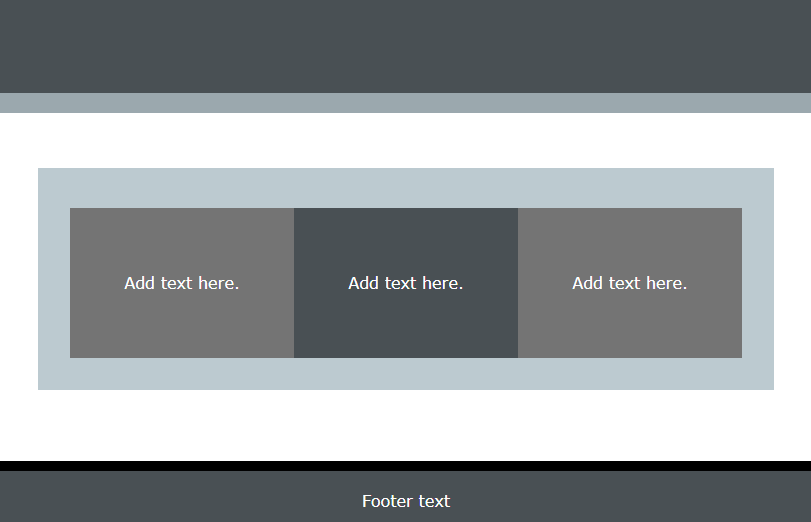

The code example creates three tiles of equal height. The text within the tile is centred on the x- and y-axis. 

+ `xcenter` places the text in the centre horizontally
+ `ycenter` places the text in the centre vertically
+ `tile` sets a fixed height for the `div` content

--- code ---
---
language: HTML
filename: index.html
line_numbers: true
line_number_start: 
line_highlights: 
---
      <section class="wrap">
        

          
Add text here.

        

        

          
Add text here.

        

        

          
Add text here.

        

      </section>
--- /code ---
