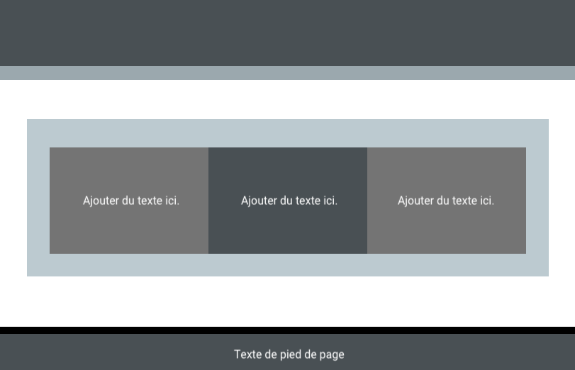

L'exemple de code ci-dessous créera trois tuiles de même hauteur. Le texte dans la tuile sera centré sur l'axe x et y.

- `xcenter` place le texte au centre horizontalement
- `ycenter` place le texte au centre verticalement
- `tile` définit une hauteur fixe pour le contenu `div`

--- code ---
---
language: HTML
filename: index.html
line_numbers: true
line_number_start: 
line_highlights: 
---
  <section class="wrap">
    

      
Ajouter du texte ici.

    

    

      
Ajouter du texte ici.

    

    

      
Ajouter du texte ici.

    

  </section>
--- /code ---
