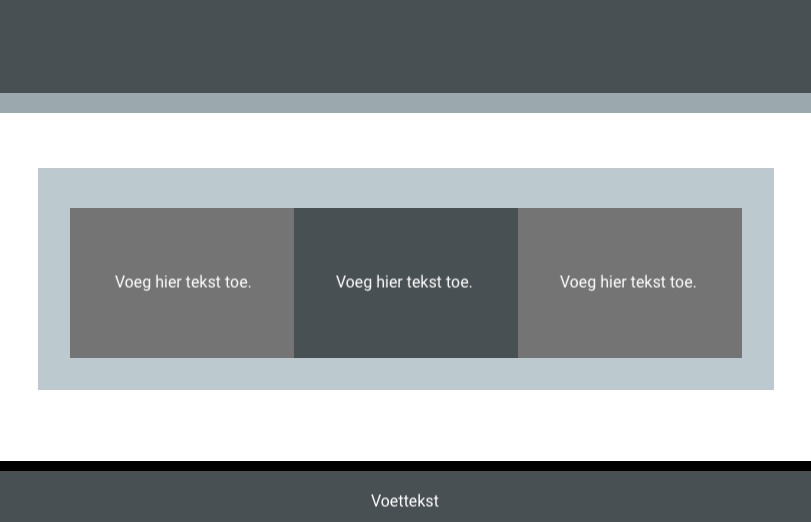

Het voorbeeld van de code hieronder maakt drie tegels van gelijke hoogte. De tekst in de tegel wordt gecentreerd op de x- en y-as.

- `xcenter` plaatst de tekst horizontaal in het midden
- `ycenter` plaatst de tekst verticaal in het midden
- `tile` stelt een vaste hoogte in voor de `div`-inhoud

--- code ---
---
language: HTML
filename: index.html
line_numbers: true
line_number_start: 
line_highlights: 
---
  <section class="wrap">
    

      
Voeg hier tekst toe.

    

    

      
Voeg hier tekst toe.

    

    

      
Voeg hier tekst toe.

    

  </section>
--- /code ---
