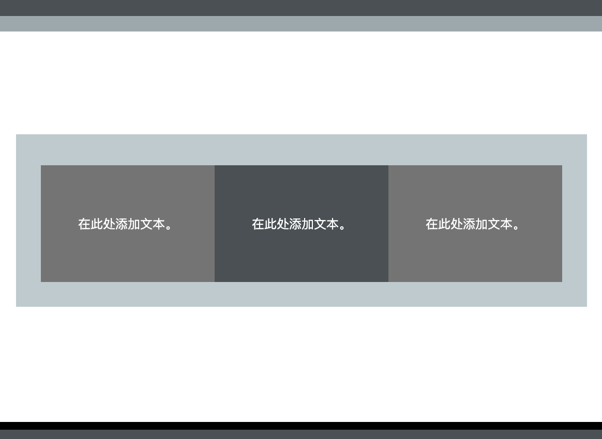

该代码示例创建了三个等高的块。 块内的文本位于 x 轴和 y 轴的中心。

- `xcenter` 将文本水平居中
- `ycenter` 将文本垂直居中
- `tile` 为 `div` 内容设置固定高度

## --- code ---

language: HTML
filename: index.html
line_numbers: true
line_number_start:
line_highlights:
-----------------------------------------------------

```
  <section class="wrap">
    <div class="tertiary xcenter ycenter tile">
      <p>在此处添加文本。</p>
    </div>
    <div class="secondary xcenter ycenter tile">
      <p>在此处添加文本。</p>
    </div>
    <div class="tertiary xcenter ycenter tile">
      <p>在此处添加文本。</p>
    </div>
  </section>
```

\--- /code ---
